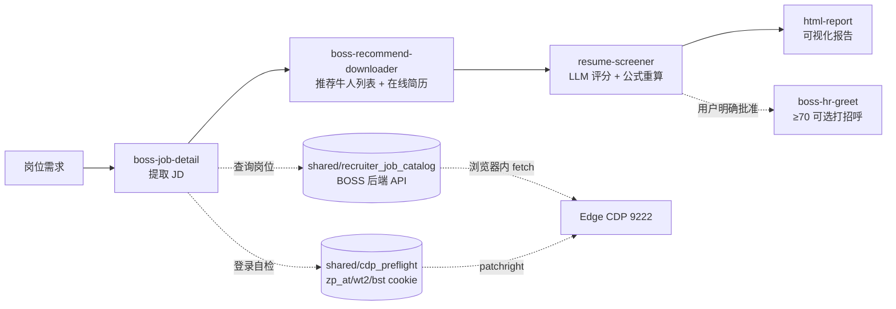

# BOSS 直聘 · HR 智能体技能包

> [!NOTE]
> 由 **7 个 AI 智能体 Skill** 组成，基于 patchright + CDP 直连真实 Edge 浏览器（共享 wt2/zp_at/bst cookie），提供从岗位解析、在线简历读取、评分到可视化报告的可追溯工作流；候选池确认和语义评分由用户 / Agent 协作完成。
>
> **统一入口 CLI `boss-hr`**：所有 Agent / 用户通过 [`boss-hr` 命令](docs/CLI_WORKFLOW.md)（`boss-hr start / confirm / fetch / score / report / greet / status`）调用本工具包。**禁止直接调用底层脚本**。详见 [`boss-hr-auto/SKILL.md`](boss-hr-auto/SKILL.md)。
>
> **自包含**：不依赖第三方 BOSS CLI。所有 BOSS HTTP 调用走浏览器内 fetch（自动带 cookie + TLS 指纹），岗位查询走 `shared/recruiter_job_catalog.py`，登录检测走 `shared/cdp_preflight.py`。
>
> **当前发布形态**：**GitHub 源码工具包 + editable install**（`pip install -e .`）。**不是**独立 wheel，**不**依赖移动源码后仍能运行。移动源码后必须重新 `pip install -e .` 才能继续使用 `boss-hr` 命令。
>
> **运行形态**：这是 Python CLI + 专用 Edge CDP 工具，**不需要 Docker**，也没有常驻本地后台或管理网页。HTML 仅是生成后的静态筛选报告。

<p align="center">
  
  
  
  
</p>

---

## 📑 目录

- [✨ 这是什么](#-这是什么)
- [🎯 核心能力](#-核心能力)
- [🧩 技能一览与工作流](#-技能一览与工作流)
- [🚀 快速开始](#-快速开始-cli-工作流)
- [📘 Windows 操作说明](docs/USER_GUIDE_ZH.md)
- [🧠 评分系统](#-评分系统)
- [🛡️ 安全与风控](#️-安全与风控)
- [📂 项目结构](#-项目结构)
- [📤 输出文件](#-输出文件)
- [⚙️ 环境变量](#️-环境变量)
- [🔗 相关链接](#-相关链接)

---

## 🚀 快速开始（CLI 工作流）

**前置**：Windows + Python 3.10+ + Edge 浏览器。

### Windows 一键安装与启动

```powershell
cd D:\project\boss-hr-agent-toolkit
.\install-windows.bat
.\start-windows.bat
```

- `install-windows.bat` 执行 editable install 并验证统一 CLI。
- `start-windows.bat` 检查环境、启动或复用专用 Edge，并打开 BOSS 招聘者页面；输出默认存入项目内的 `boss-hr-output/`。不带岗位参数时不会创建 run、读取简历或发送招呼。
- 要直接创建岗位 run，可执行 `.\start-windows.ps1 -Query "AI应用工程师"`；成功后会停在人工确认门，不会自动继续抓取或发送消息。
- 完整安装、登录、只读筛选、状态说明和故障排查见 [Windows 操作说明](docs/USER_GUIDE_ZH.md)。

> **v1.1.3 自动恢复**：**不需要**预先手动启动 Edge，也**不需要**预先跑
> `boss-hr doctor`。直接 `boss-hr start` 即可：
>
> - 9222 已开 + 已登录 → 立即进入业务；
> - 9222 未开 → 自动启动**专用** Edge
>   （`%LOCALAPPDATA%\boss-hr-edge-profile` + `--remote-debugging-port=9222`，
>   **不**污染日常 Edge profile）；
> - 自动启动后未登录 → 自动打开 BOSS 招聘者登录页并立即返回；
> - 返回 `status=waiting_user_login`（**不是错误**），**不创建 run**；
> - 用户在专用 Edge 窗口内登录后，**重试同一条 start** 即可继续。
>
> `boss-hr doctor` 仍是独立诊断工具，但**不再是 start 的必经前置**。

```powershell
git clone https://github.com/<owner>/boss-hr-agent-toolkit
cd boss-hr-agent-toolkit
python -m pip install -e .

# 验证安装
boss-hr --help          # 应列 8 个公开命令（含 doctor）
python -m boss_hr --help # 等价入口
```

完整 8 命令工作流（详见 [docs/CLI_WORKFLOW.md](docs/CLI_WORKFLOW.md)）：

```powershell
# 1. 直接创建新 run（停在人工确认门；v1.1.3 自动启动 Edge，未登录时立即返回提示）
boss-hr start "<encryptJobId|jobId|岗位名>" --job-name "<岗位名>" --encrypt-job-id "<id>"
# → status=waiting_user_confirmation，run_id=...
# → 智能体停下，告知用户在 BOSS 推荐牛人页面调整筛选条件
# 若 start 返回 status=waiting_user_login：智能体停下，告知用户在专用
# Edge 中登录后重试同一条 start

# 用户回复"继续"后：
# 2. confirm + fetch
boss-hr confirm --job-name "<>" --encrypt-job-id "<>" --run-id "<rid>"
boss-hr fetch   --job-name "<>" --encrypt-job-id "<>" --run-id "<rid>" --count N

# 3. score 循环（每轮评一位；逐位重复直到 scoring_complete）
boss-hr score   --job-name "<>" --encrypt-job-id "<>" --run-id "<rid>"
# → 读返回的 input_file、按 resume-screener/SKILL.md 评 4 维度（不评 edu）、
#   写 output_file、再调一次相同的 score；若仍是 waiting_llm，继续下一位
boss-hr score   --job-name "<>" --encrypt-job-id "<>" --run-id "<rid>"
# → 全部候选人处理完后 status=scoring_complete

# 4. report
boss-hr report  --job-name "<>" --encrypt-job-id "<>" --run-id "<rid>"

# 5.（可选 + 用户明确批准时）greet — 这是**真实写操作**
boss-hr greet   --job-name "<>" --encrypt-job-id "<>" --run-id "<rid>"

# 6. 任意时点查看当前 run 状态
boss-hr status  --job-name "<>" --encrypt-job-id "<>" --run-id "<rid>"
```

> ⚠️ **当前限制（GitHub 首版）**：
> - 不支持 `continue` / `batch` / 多批累计
> - `fetch` 目前只读取“推荐牛人”的在线完整简历；尚未接入附件简历或“主动发起沟通 / 新招呼”候选人列表
> - 真实 `greet` 成功点击（≥70 分候选人实际点击发送）尚未完成受控验证
> - 仅在 Windows 上完整验证过；macOS / Linux 需自测

---

## ✨ 这是什么

你有一个岗位，剩下的交给 AI：

```
   岗位          →   AI 自动提取 JD   →   自动下载候选人简历   →   自动评分排名   →   可视化报告
(一句话需求)        (boss-job-detail)      (boss-recommend-downloader)    (resume-screener)     (html-report)
                                                                                         └→ 可选显式打招呼
```

**一句话概括：** AI 帮你在几十份简历中筛出更匹配的候选人，生成可复核的评分报告；只有明确执行 `greet` 时才会给候选人打招呼。

---

## 🎯 核心能力

| 能力 | 说明 |
|:----:|------|
| 🔍 **JD 提取** | 一键抓取岗位详情、任职要求与核心技能点 |
| 📥 **简历获取** | 从推荐牛人页面获取完整简历，真实浏览器指纹，低风控 |
| 🧮 **智能评分** | 5 维度加权评分 + 学历分档校准，硬门槛过滤 |
| 📬 **可选打招呼** | 只有用户明确批准并执行 `greet` 时，才给 ≥70 分的推荐 tier 候选人点击打招呼 |
| 📊 **可视化报告** | 排名表 + 五维雷达图 + 个性化沟通建议，HTML 一键生成 |
| 🧪 **可测试** | 核心算法由 `tests/` 单元测试用例覆盖 |

> **🚪 `boss-hr-auto` 是唯一入口**，其余 Skill 是其子步骤。使用时始终从 `boss-hr-auto` 开始。

> **🆕 v2 接口（2026-07-29+）**：6 个 CLI 脚本全部接受 `--encrypt-job-id`（或 env `BOSS_HR_ENCRYPT_JOB_ID`），目录名从中文岗位名改为 BOSS 的 `encryptJobId`。详见 [📤 输出文件](#-输出文件新设计--2026-07-29) 章节。

---

## 🧩 技能一览与工作流

| # | Skill | 角色 | 作用 |
|:-:|------|:----:|------|
| 0 | **boss-hr-auto** | 🚪 入口 | 编排全流程工作流（唯一入口，5 步串到底） |
| 2 | boss-job-detail | Step 1 | 提取岗位 JD |
| 3 | **boss-recommend-downloader** | Step 2 | 从推荐牛人页面获取完整简历（含 run_all 一把梭） |
| 4 | resume-screener | Step 3 | 硬门槛过滤 + 加权评分 + 学历分档 |
| 5 | html-report | Step 4 | 生成可视化 HTML 报告 + 沟通建议 |
| 5+ | **boss-hr-greet** | 可选 Step 5 | 用户明确批准后，给高分候选人打招呼 |
| lib | shared/cdp_preflight | 基础 | CDP 连接 + 登录态探测 |
| lib | shared/recruiter_job_catalog | 基础 | 招聘者岗位列表 + encryptJobId 解析 |

### 工作流示意图



虚线箭头表示**底层依赖**：`boss-job-detail` 通过 `recruiter_job_catalog` 查岗位列表，
每个 Step 入口通过 `cdp_preflight` 自检登录态；二者都通过 patchright 连到本地
Edge 9222 端口（共享同一份 wt2/zp_at/bst cookie）。

---

## 🚀 快速开始

> **无需打包任何二进制文件。** 以下全部通过包管理器安装，浏览器用系统自带的即可。

### 前置依赖

| 依赖 | 说明 | 安装方式 |
|------|------|---------|
| Python 3.10+ | 运行脚本 | [python.org](https://python.org) |
| patchright | CDP 客户端（**不含浏览器，不下载 Chromium**） | `pip install patchright` |
| Chrome / Edge | 系统自带即可 | 已装直接跳过 |

### 1. 安装

```powershell
# 推荐：安装依赖、editable install 并验证 boss-hr
.\install-windows.bat

# 等价的手动安装
python -m pip install -e .
```

### 2. 启动 CDP 浏览器

Windows 用户可直接运行：

```powershell
.\start-windows.bat
```

它会启动或复用专用 Edge 并打开 BOSS 招聘者页面。详细参数见 [Windows 操作说明](docs/USER_GUIDE_ZH.md)。

**正常流程无需手动启动**：`boss-hr start` 会自动启动专用 Edge
（`%LOCALAPPDATA%\boss-hr-edge-profile` + `--remote-debugging-port=9222`），
并在专用 Edge 中打开 BOSS 登录页等待登录。

仅当自动启动失败、或你希望手动控制时，使用下面命令：

**Windows（推荐自带 Edge）：**

```powershell
Start-Process "msedge" -ArgumentList `
  "--remote-debugging-port=9222", `
  "--user-data-dir=$env:LOCALAPPDATA\boss-hr-edge-profile"
```

**macOS / Linux：**

```bash
google-chrome \
  --remote-debugging-port=9222 \
  --user-data-dir="$HOME/.boss-hr-edge-profile"
```

### 3. 登录

在打开的 Edge 窗口里**人工扫码登录 BOSS 招聘者**，登录态会被 9222 端口的浏览器 session 持有。

v1.1.3 默认行为：start / fetch / greet 都会在需要时启动专用 Edge，并在未登录时打开 BOSS 登录页。`start` 默认立即返回 `waiting_user_login`；登录后重跑同一命令即可。`boss-hr doctor` 也支持 `--launch-edge` 手动启动专用 Edge。

验证逻辑会检查 `zp_at` / `wt2` / `bst` 三个 Cookie 是否齐全。普通用户应使用统一 CLI 自检：

```powershell
python -X utf8 -m boss_hr doctor
```

### 4. 开始使用

在智能体中调用：

```
@skill://boss-hr-auto 车架工程师
```

或直接说：

```
帮我筛选车架工程师的简历
```

只读筛选可明确说：

```text
筛选 AI应用工程师，只读取 10 份在线完整简历，生成报告，不发送招呼。
```

---

## 🧠 评分系统

### 当前权重（5 维加权求和）

> [!NOTE]
> 当前 `resume-screener/scripts/score_resumes.py` 已统一为**单套 5 维权重**（合计 100%）。如需区分岗位类型，建议在 `WEIGHTS` 常量上扩展，不要直接硬编码多套。

| 维度 | 权重 | 评分方法 |
|------|:----:|---------|
| 学历 (edu) | **15%** | `validate_score()` 用国内院校分档和热门海外院校排名快照**强制覆盖** LLM 给的 edu 分 |
| 工作经验 (exp) | **35%** | 相关经验年限 + 业务匹配度 |
| 专业技能 (skill) | **25%** | JD 技能覆盖率 |
| 项目经历 (proj) | **15%** | 项目复杂度 + 相关性 |
| 专业匹配 (major) | **10%** | 对口=100%，相关=80%，无关=30-60% |

### 总分与档位

- `weighted[d] = round(dims[d] * WEIGHTS[d], 2)`
- `total = round(sum(weighted.values()), 1)`
- 档位阈值：`>= 70` → **推荐**　`>= 60` → **待定**　否则 → **不推荐**
- 全部逻辑在 `resume-screener/scripts/score_resumes.py`，由 `tests/` 下的单元测试用例覆盖：`python -m pytest tests/`

### 学历分档表

| 档次 | 分数 | 示例 |
|------|:----:|------|
| C9 | 100 | 清华、北大、复旦、交大等 |
| 985 | 92 | 其他 985 高校 |
| 211 | 85 | 其他 211 高校 |
| 双一流 | 77 | 双一流建设高校 |
| 一本公办 | 71 | 省属重点一本 |
| 二本公办 | 62 | 普通公办二本 |
| 民办本科 | 53 | 民办高校、独立学院 |

> [!IMPORTANT]
> 学历评分必须严格执行分档表，**禁止给所有人相同分数**。

### 海外院校评分

- 后端内置中国求职者较常见的海外院校及别名，数据快照日期为 **2026-09-29**。
- 以 QS 2027 为主，THE 2026、ARWU 2026 为补充；按世界排名区间映射到国内院校分档的对应分数。
- QS 1–30 / 31–100 / 101–300 / 301–500 / 501–800 / 801–1500 分别映射为 100 / 92 / 85 / 77 / 71 / 62 分；经核验但未入榜的私立院校按 53 分。
- 学校名称只做规范化后的精确别名匹配；未命中暂按 60 分并标记人工复核，避免相似名称误判。
- 逻辑位于 `resume-screener/scripts/overseas_school_data.py` 和 `school_tier.py`。本次改动只影响后端学历评分，不改变报告版式。

### 行动建议规则

输出格式：`📊 排名表（含 5 维加权分）+ 📋 每人评分依据 + 🎯 个性化行动建议`

- **推荐面试**：每人必须写「候选人背景」+「沟通方向」
- **待沟通确认**：每人必须写「优势」+「需确认问题」
- ❌ 禁止所有人使用相同的沟通方向

---

## 🛡️ 安全与风控

### 推荐牛人下载

| 做法 | 说明 |
|:----:|------|
| ✅ 真实浏览器 TLS 指纹 | 通过 patchright 在 Edge 内 fetch，服务器无法区分真人 |
| ✅ 滚动延迟 3-6 秒随机 | 模拟真人浏览 |
| ✅ 简历获取 60-120 秒随机（每 5 人触发一次长延迟） | 模拟真人阅读 + 风控 |
| ✅ 建议工作时间运行 | 9:00-18:00 |
| ✅ 单次建议不超过 50 人 | 超过则分批次 |

### 通用规则

- ✅ 默认只读流程不执行 `greet`；只有用户明确批准并显式运行 `boss-hr greet` 才会发送招呼
- ✅ 批量操作间隔随机延迟
- ✅ 增量同步（已下载简历自动跳过）
- ✅ Cookie 优先从浏览器本地提取

### 风控检测维度

| 维度 | 安全做法 | 危险做法 |
|------|---------|---------|
| 请求频率 | 5-20 秒随机 | 固定间隔或高频 |
| 操作时间 | 工作时间 | 凌晨 |
| 行为模式 | 有滚动有停顿 | 纯 API 无页面交互 |
| 总量控制 | 分批次 | 一次几百个 |

---

## 📂 项目结构

```
boss-hr-agent-toolkit/
├── README.md                          # 本文件
├── install-windows.bat                # Windows editable install
├── start-windows.bat                  # Windows 双击启动入口
├── start-windows.ps1                  # 环境检查、专用 Edge 与可选岗位启动
├── FILE_MANAGEMENT.md                 # 文件管理规范
├── .gitignore
├── docs/
│   ├── USER_GUIDE_ZH.md               # Windows 安装、启动与只读筛选说明
│   └── CLI_WORKFLOW.md                 # 统一 CLI 状态机和开发者说明
│
├── boss-hr-auto/                      # 🚪 全流程编排（唯一入口，纯文档）
│   └── SKILL.md                        # 智能体按此文档顺序调用各子 Skill 脚本
│
├── boss-job-detail/                   # Step 1：JD 提取
│   ├── SKILL.md
│   └── scripts/boss_jd.py
│
├── boss-recommend-downloader/         # Step 2：推荐牛人列表 + 在线简历
│   ├── SKILL.md
│   └── scripts/
│       ├── recommend_list.py          # 获取候选人列表
│       ├── recommend_download.py      # 批量获取简历（patchright + fetch）
│       └── run_all.py                 # 一键运行（list + download）
│
├── resume-screener/                   # Step 3：评分系统
│   ├── SKILL.md
│   └── scripts/
│       ├── score_resumes.py           # 加权评分 + 分档校准
│       ├── school_tier.py             # 国内分档、别名归一化与统一查询
│       └── overseas_school_data.py    # 热门海外院校与官方排名快照
│
├── html-report/                       # Step 4：报告生成
│   ├── SKILL.md
│   ├── scripts/generate_html_report.py
│   └── templates/report.html
│
├── boss-hr-greet/                     # 可选 Step 5：明确批准后打招呼
│   ├── SKILL.md
│   └── scripts/auto_greet.py          # 位置表 + 倒序招呼
│
├── shared/                            # 共享工具
│   ├── output_manager.py              # 统一文件路径管理
│   ├── run_orchestrator.py            # 跨 Step run_id 编排
│   ├── job_resume_store.py            # 候选人键 + 状态读写 + 简历合并
│   ├── human_interaction.py           # 拟人鼠标移动
│   └── fix_encoding.py                # 编码修复
│
└── tests/                             # 单元测试
    ├── conftest.py
    ├── test_school_tier.py
    └── test_score_resumes.py
```

---

## 📤 输出文件（新设计 · 2026-07-29+）

> **目录名 = BOSS 的 `encryptJobId`**（不再是中文岗位名）。`job_name`（中文岗位名）只作为 `jobs.json` 里的可读元数据。这样做的核心原因：避免中文路径在 URL/文件 IO 里的编码翻车；6 个 CLI 脚本统一通过 `--encrypt-job-id`（或 env `BOSS_HR_ENCRYPT_JOB_ID`）透传给 `JobOutputManager`，**路径选择集中在 shared 层**。

```
~/Desktop/boss-hr-output/                         # 工作区根（可用 BOSS_HR_OUTPUT_DIR 改）
├── jobs.json                                      # JobRegistry：encryptJobId → {name, company}
└── <encryptJobId>/                                # 例如 9a7759badfd95d350nFz3d-_F1NX
    ├── state/                                     # 跨 run 保留（不覆盖）
    │   ├── candidate_pool.json
    │   ├── download_state.json
    │   ├── resumes_master.json                    # 累计简历（含 _meta）
    │   ├── collection_state.json
    │   ├── scored_state.json
    │   ├── geek_positions.json
    └── runs/                                       # 每次筛选任务一个 run_id 子目录
        └── <run_id>/
            ├── <run_id>_screening_report.html     # 最终 HTML 报告
            └── process/                            # 过程文件（留痕查阅）
                ├── job_detail.json                 # Step 1 输出
                ├── recommend_geek_ids.json         # Step 2a 输出
                ├── new_resumes.json                # Step 2b 输出
                ├── scoring/                        # Step 3a 净化层输出
                │   ├── manifest.json
                │   ├── inputs/candidate_<geek_id>.json
                │   └── outputs/candidate_<geek_id>.json
                ├── _llm_scores.json                # Step 3b collect 合并产物
                ├── screening_results.json          # Step 3c score 收尾产物
                ├── failed_resumes.json
                └── greet_log.json                  # Step 5 输出
```

### 🚨 严格模式（缺 `--encrypt-job-id` 直接报错）

6 个 CLI 脚本（`boss_jd.py` / `recommend_list.py` / `recommend_download.py` / `score_resumes.py` / `generate_html_report.py` / `auto_greet.py`）**必须传 `--encrypt-job-id`**（或 env `BOSS_HR_ENCRYPT_JOB_ID`）。缺则：

```
ValueError: 缺少 encrypt_job_id。
  传 --encrypt-job-id，或设置 env BOSS_HR_ENCRYPT_JOB_ID
```

不会静默回退到中文目录名——避免你以为跑了新路径、实际又落到中文路径的事故。

> [!TIP]
> - 禁止在桌面散落文件；HTML 报告放 run 目录（文件名含 run_id，永不覆盖历史），中间数据放 `process/`
> - 临时 Python 脚本任务结束后删除
> - 复用 skill 内已有的 Python 脚本，禁止重复造轮子
> - 同一 job 的 5 步脚本必须传**同一个** `--encrypt-job-id` 和 `--run-id`
>
> 详见 [FILE_MANAGEMENT.md](FILE_MANAGEMENT.md)。

---

## ⚙️ 环境变量

| 变量 | 说明 | 默认值 |
|------|------|--------|
| `BOSS_BIN` | boss CLI 路径 | `boss` |
| `CDP_URL` | 浏览器 CDP 调试地址 | `http://localhost:9222` |
| `BOSS_HR_OUTPUT_DIR` | 工作区根 | `~/Desktop/boss-hr-output` |
| `BOSS_HR_ENCRYPT_JOB_ID` | BOSS 加密岗位 ID（=工作区子目录名） | 缺则 `ValueError` |
| `PYTHONHOME` | **必须清空** | `""` |
| `PYTHONIOENCODING` | 避免 CLI 编码问题 | `utf-8` |

---

## 🔗 相关链接

- [patchright](https://github.com/Kaliiiiiiiiii-Vinyzu/patchright) — Playwright 分支（CDP 浏览器控制）

---

## 📄 License

[MIT](https://opensource.org/licenses/MIT)
